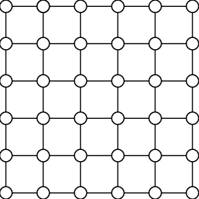
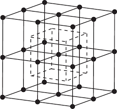

## Bravais Lattice
A Bravais lattice is simply a repeating pattern of arrangement of atoms with all points in pattern being equivalent. Alternatively, it is the lattice in which atoms present at all latice points are identical.
### Determining lattice points
In a given lattice, we can select a random point and examine its surroundings. We will notice that, if a repeating pattern exists, there will be surrounding points to the reference point which have identical surroundings themselves. Once all such surrounding points are found, we have essentially found out a **lattice**, and the points that make this lattice are called **lattice points**.
### Examples of Bravais lattice
The simplest example for a Bravais lattice is a square lattice.

  

The simplest example for a Bravais lattice in three dimensions is a cubic lattice

  

### Primitive vectors
Primitive vectors are the vectors with which a Bravais lattice can be re-constructed. Formally, a Bravais lattice (in three dimensions) can be defined with primitive vectors, as a collection of all and only those points in space that are reachable from origin with the position vectors defined as
$$\bar r = n_{1}\bar a_{1} + n_{2}\bar a_{2} + n_{3}\bar a_{3}$$
where it is necessary for $n_{1}$, $n_{2}$, $n_{3}$ to be $0$ or a negative/positive integer. The three vectors used above are the **primitive vectors**.

## Primitive vectors
Primitive vectors are the vectors with which a Bravais lattice can be re-constructed. Formally, a Bravais lattice (in three dimensions) can be defined with primitive vectors, as a collection of all and only those points in space that are reachable from origin with the position vectors defined as
$$\bar r = n_{1}\bar a_{1} + n_{2}\bar a_{2} + n_{3}\bar a_{3}$$
where it is necessary for $n_{1}$, $n_{2}$, $n_{3}$ to be $0$ or a negative/positive integer. 
The three vectors used above are the **primitive vectors**.

This experiment now aims at giving an understanding of defining primitive vectors.
