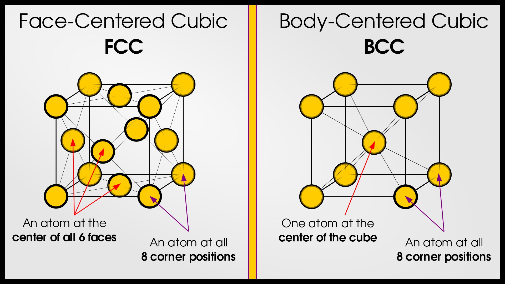

## Bravais Lattice
A Bravais lattice is a mathematical construct representing an infinite array of discrete points in three-dimensional space such that the environment around each point is identical. An alternative method to generate Bravais lattice is to start with a single point and consider all points that can be reached by translating this point by integer multiples of three (non-planar) vectors; this infinite set of points is Bravais lattice (with single point basis).
A Bravais lattice forms the framework upon which a crystal structure is built. While the lattice itself is an abstract concept (an array of points), a crystal structure is formed by associating a motif (such as an atom, molecule, or group of atoms) with each lattice point. 

### Mathematical Representation of a Lattice
The position of a lattice point is given by:
$$ \bar r = n_{1}\bar a_{1} + n_{2}\bar a_{2} + n_{3}\bar a_{3} $$
Where:
- $ a_{1} $, $ a_{2} $, $ a_{3} $ are the primitive vectors which generate the lattice 
- $ n_{1} $, $ n_{2} $, $ n_{3} $ are the integers representing the coordinates of the lattice point relative to the origin.
These coordinates generate a repeating pattern that extends infinitely in all directions, forming the lattice.

### Characteristics of Bravais Lattices
Key characteristics of Bravais lattices:
- **Periodicity**: Each point has an identical environment, creating a repeating pattern in three dimensions.
- **Unit Cell**: The smallest building block of a lattice that can generate the entire structure by translation.
- **No Physical Atoms**: The lattice is an **abstract geometric construct**; it represents the arrangement of points in space, not atoms. 

### Types of Bravais Lattices
There are **14 types of Bravais lattices**, grouped into seven crystal systems based on symmetry and geometry. Two common examples are: 
- Face-Centered Cubic (FCC): Lattice points are located at the corners and center of each face of the cube. 
- Body-Centered Cubic (BCC): Lattice points are located at the corners and the center of the cube. 

For a visual representation, see the diagrams below or explore these structures in the simulation. 

  

### How Lattices Form Crystals
To form a crystal, a **motif** is associated with each lattice point.
- The **lattice** provides the periodic framework. 
- The **motif**(atoms, molecules, etc.) is repeated at every lattice point.
Together, these create the **crystal structure**, which exhibits periodicity and symmetry. For example, In an FCC lattice, if a single atom is used as the motif, it forms a crystal structure like that of copper.
